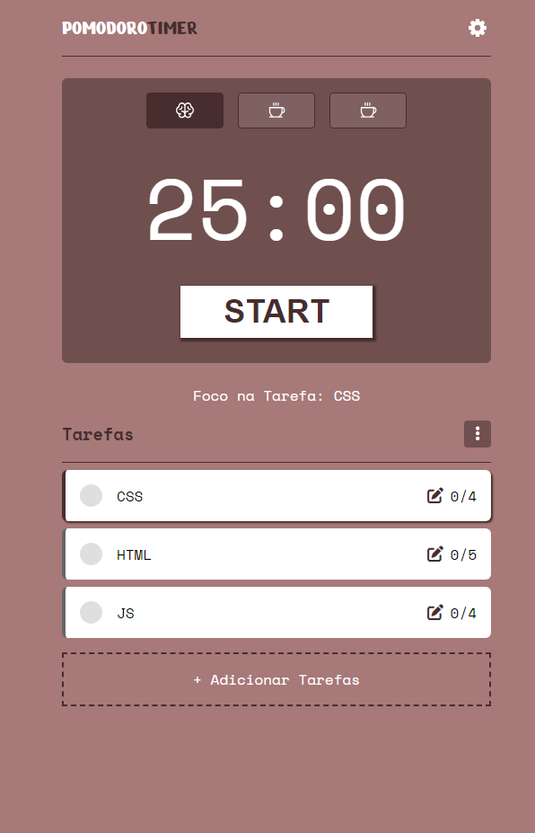

<h1>PomodoroTimer</h1>

[ 🔗​ Clique aqui para acessar](https://pomodoro-timer-gules-ten.vercel.app/)

PomodoroTimer é uma aplicação web inspirada no método Pomodoro, desenvolvida para auxiliar na gestão eficiente do tempo e na melhoria da produtividade. Utilizando tecnologias como HTML, CSS, JavaScript e SASS, o PomodoroTimer oferece um timer configurável, permitindo ao usuário dividir o trabalho em intervalos de tempo (pomodoros) e pausas, seguindo a técnica Pomodoro.

Além do timer, o PomodoroTimer inclui funcionalidades adicionais, como a capacidade de adicionar e gerenciar tarefas, permitindo ao usuário manter o foco em suas atividades. O projeto está em constante evolução, com novas funcionalidades e melhorias sendo adicionadas regularmente.

## 🛠️ Tecnologias

 

---
Feito por  [Gabriel Robertson](https://github.com/Gabrielrsc) 🤖
